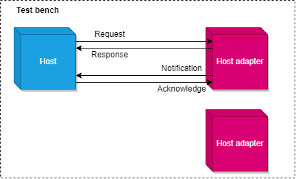

====================================
HA high-level protocol specification
====================================

:Authors: - Florian Dupeyron <florian.dupeyron@mugcat.fr>
:Date: February 2024

Scope
=====

The scope of this specification is to specify the high-level description of the HA (Host Adapter) protocol

Terms and definitions
=====================

.. csv-table::
   :file: ./tables/abbreviations.csv
   :header-rows: 1
   :delim: |

General description
===================

The goal of the HA protocol is to provide an easy to implement, end-to-end application protocol to implement Host Adapters interfaces. The idea is to provide a simple equest/answer protocol implementation

General definitions
===================

   
   Illustration of definitions

[`HA-HLRS-####`] Bench
----------------------

:Version: 1.0

The `Bench` **shall** describe the global setup that may include a **host** and one or more **host adapters**.

[`HA-HLRS-####`] Host
---------------------

:Version: 1.0

The `Host` shall describe the main processing unit of the the `Bench`. It may aggregate several `Host adapters`, and shall orchestrate the
communication operations with them.

[`HA-HLRS-####`] Host Adapter
-----------------------------

:Version: 1.0

A `Host Adapter` may provide a `Host` an implementation of a specific electronic function, for instance: GPIO control, PWM control, Analog measurements...

[`HA-HLRS-####`] Types of transfer
----------------------------------

:Version: 1.0

Types of transfer may occur in two directions:

1. From the `Host` to the `Host Adapter`:
   1. A `Request` is a transfer that is initiated by the `Host` to the `Host Adapter`.

   2. A `Response` is a transfer that is initiated by the `Host Adapter` to the `Host`. A `Reponse` follows a `Request`, and provide information about its status.

2. From the `Host Adapter` to the `Host`

   1. A `Notification` is a transfer that is initiated by the `Host Adapter` to the `Host`.

   2. An `Acknowledge` is a transfer that is initiated by the `Host` to the `Host Adapter`. A `Acknowledge` follows a `Notification`, and gives information on its reception status.

HA protocol frames specification
================================

HA Frames format
----------------

[`HA-HLRS-####`] HA Frame layout
++++++++++++++++++++++++++++++++

:Version: 1.0

1. An HA frame may contain the following binary data:

   .. figure:: ./img/ha-frame_layout.drawio.png

      HA Frame layout

   1. `Code`: contains a 16-bit code that shall indicate what is the purpose and content of that frame. Code specification is given in **TODO**.

   2. `Data`: contains relevant payload data for this specific frame. May be of arbitrary size.
   3. `Checksum`: contains a checksum to validate the frame's integrity. Checksum speficiation is given in **TODO**.

HA Frames Codes
----------------

[`HA-HLRS-####`] HA code range
++++++++++++++++++++++++++++++

:Version: 1.0

1. HA Codes may be encoded on a unsigned 16-bit integer. That means that a HA frame can encode :math:`65536` different frame types.
2. HA Codes shall be split in the following ranges in order to allow interoperability between various HA products:

   .. csv-table:: 
      :file: tables/ha_code_ranges.csv
      :header-rows: 1
      :delim: |

HA generic response codes
+++++++++++++++++++++++++

HA Transport mechanism specification
------------------------------------